# Actividad - Explotación y Mitigación de Cross-Site Scripting (XSS)

Objetivos:

> - Recordar cómo se pueden hacer ataques de Cross-Site Scripting (XSS)
>
> - Conocer las diferentes formas de ataques XSS.
>
> - Analizar el código de la aplicación que permite ataques de Cross-Site Scripting (XSS)
>
> - Implementar diferentes modificaciones del codigo para aplicar mitigaciones o soluciones.

---
# ¿Qué es XSS?
Cross-Site Scripting (XSS) ocurre cuando una aplicación no valida ni sanitiza l>
scripts maliciosos se ejecuten en el navegador de otros usuarios.

Tipos de XSS:
- **Reflejado**: Se ejecuta inmediatamente al hacer la solicitud con un payload malicioso.
- **Almacenado**: El script se guarda en la base de datos y afecta a otros usuarios.
- **DOM-Based**: Se inyecta código en la estructura DOM sin que el servidor lo detecte

---

# Actividad a Realizar

## Iniciar entorno de pruebas

- Nos situamos en la carpeta de del entorno de pruebas de nuestro servidor LAMP e iniciamos el escenario multicontenedor: 

```bash
docker-compose up -d
```
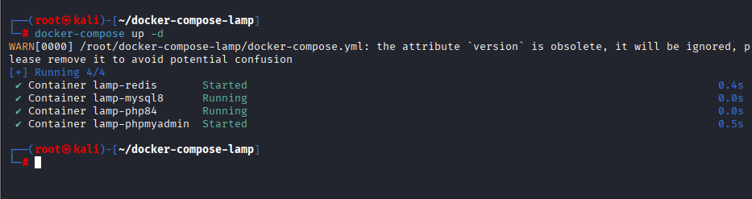

---
# Código vulnerable

Creamos el archivo vulnerable comment.php:

```PHP
<?php
// Activar errores en entorno de prácticas (opcional)
ini_set('display_errors', 1);
ini_set('display_startup_errors', 1);
error_reporting(E_ALL);

$comment = '';

if ($_SERVER['REQUEST_METHOD'] === 'POST') {
    // SIN SEGURIDAD: se guarda el comentario tal cual
    $comment = $_POST['comment'] ?? '';
}
?>
<!DOCTYPE html>
<html lang="es">
<head>
    <meta charset="UTF-8">
    <title>Comentarios INSEGUROS</title>
</head>
<body>
    <h1>Comentarios (versión insegura)</h1>

    <form method="post">
        <label for="comment">Comentario:</label><br>
        <!-- SIN htmlspecialchars: se muestra el contenido sin escapar -->
        <textarea name="comment" id="comment" rows="4" cols="50"><?= $comment ?></textarea><br>
        <button type="submit">Enviar</button>
    </form>

    <?php if ($comment !== ''): ?>
        <h2>Comentario recibido (SIN sanitizar)</h2>
        <!-- Aquí también se imprime directamente, vulnerable a XSS -->
        <p><?= $comment ?></p>
    <?php endif; ?>
</body>
</html>

```
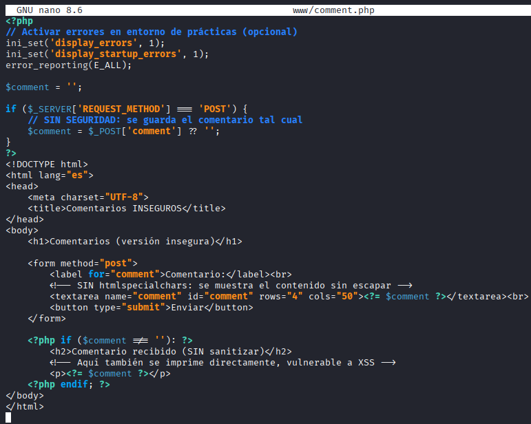

Este código muestra un formulario donde el usuario puede ingresar un comentario en un campo de texto. Cuando
el usuario envía el formulario, el comentario ingresado se muestra en la pantalla con el mensaje "Comentario publicado:
\[comentario\]". 

El Código no sanitiza la entrada del usuario, lo que permite inyectar scripts maliciosos.

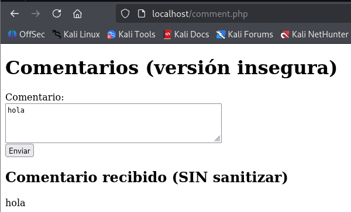

---
# **Explotación de XSS**

Abrimos el navegador y accedemos a: <http://localhost/comment.php>

** Explotación 1**
Ingresamos el siguiente código en el formulario:

```
<script>alert('XSS ejecutado!')</script>
```
Aparece un mensaje de alerta (alert()) en el navegador, lo que significa que la aplicación es vulnerable.

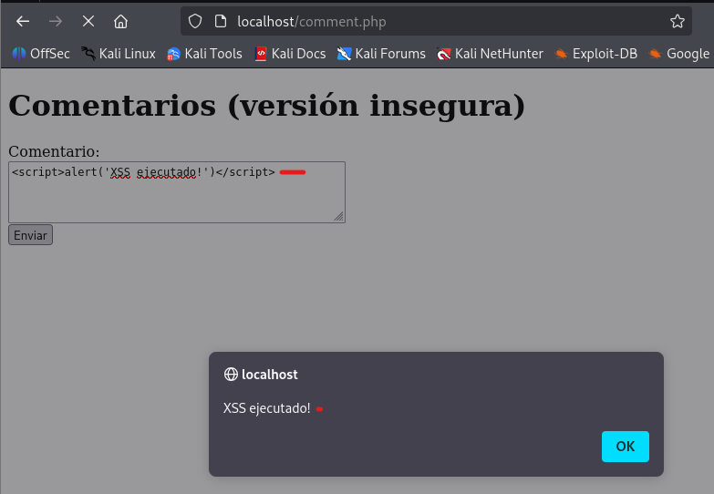

**Explotación 2**

Redirigir a una página de phishing:

`<script>window.location='https://fakeupdate.net/win11/'</script>`

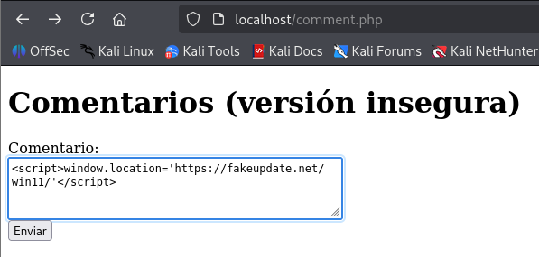

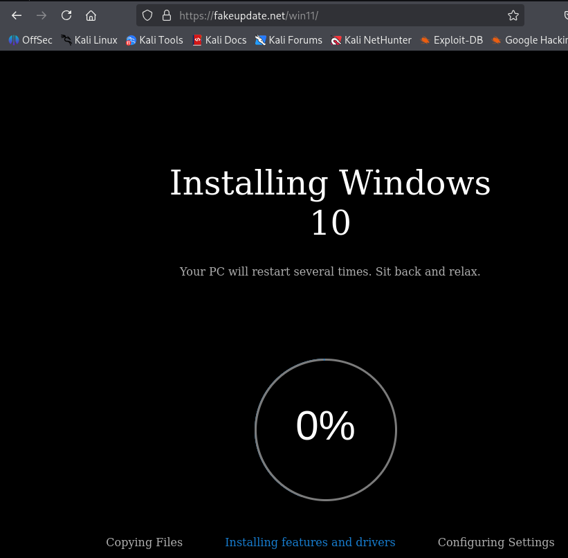


**Capturar cookies del usuario:**

En este ataque, un ciberdelincuente podría robar las sesiones de los usuarios.

- Primero preparamos el **ataque**:

Creamos una estructura de archivos que simulan un servidor atacante:

```bash
mkdir ./www/cookieStealer/
touch ./www/cookieStealer/index.php
touch ./www/cookieStealer/cookies.txt
chmod 777 ./www/cookieStealer/cookies.txt
```

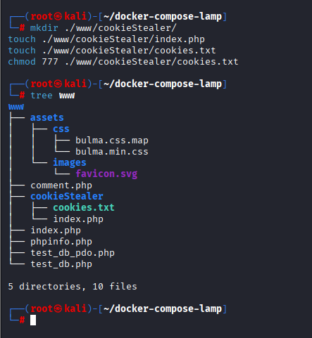


Copiamos dentro del archivo ./www/coockieStealer/index.php el siguiente código:

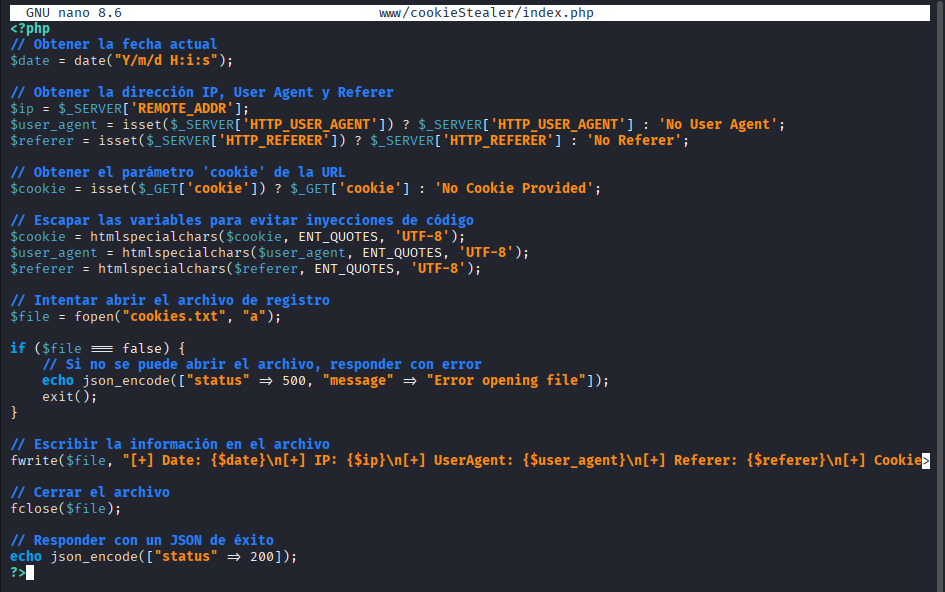

 - Ataque: Insertamos en el comentario el siguiente script:

```
<script>document.write('')</script>`
```

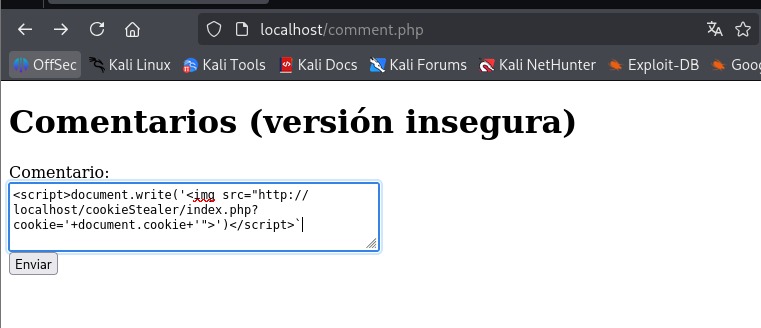

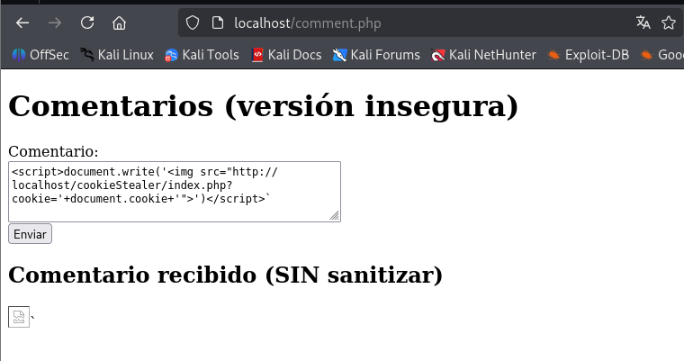

En el archivo **cookie.txt** del servidor atacante se habrán guardado los datos de nuestra cookie, asi que lo visualizamos:

```bash
cat ./wwww/cookieStealer/cookies.txt
```

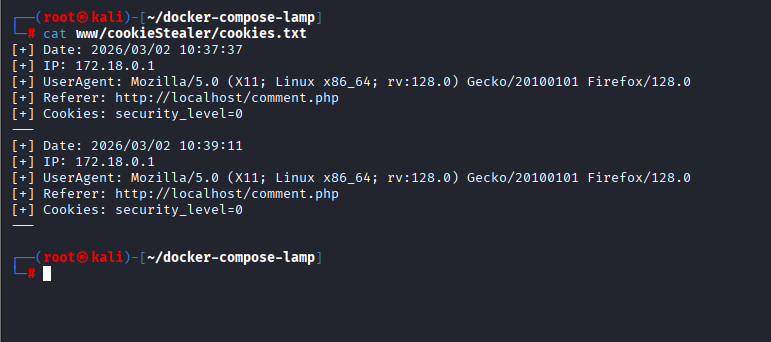

Con estas cookies, un atacante se podría pasar por nosotros en una web externa y suplantar nuestra identidad.

---

# **Mitigaciones**

**Uso de filter_input() para filtrar caracteres.**

Filtra caracteres problemáticos.

Creamos el documento comment1.php con el siguiente contenido:

```php
<?php
// Activar errores en entorno de prácticas
ini_set('display_errors', 1);
ini_set('display_startup_errors', 1);
error_reporting(E_ALL);

function filter_string_polyfill(string $string): string
{
    // Elimina caracteres nulos y etiquetas HTML
    $str = preg_replace('/\x00|<[^>]*>?/', '', $string);
    // Sustituye comillas por entidades HTML
    return str_replace(["'", '"'], ['&#39;', '&#34;'], $str);
}

$comment = '';

if ($_SERVER['REQUEST_METHOD'] === 'POST') {
    // Obtener el comentario enviado (o cadena vacía si no existe)
    $raw = $_POST['comment'] ?? '';
    // Sanitizarlo
    $comment = filter_string_polyfill($raw);
}
?>
<!DOCTYPE html>
<html lang="es">
<head>
    <meta charset="UTF-8">
    <title>Comentarios seguros</title>
</head>
<body>
    <form method="post">
        <label for="comment">Comentario:</label><br>
        <textarea name="comment" id="comment" rows="4" cols="50"><?= htmlspecialchars($comment, ENT_QUOTES | ENT_SUBSTITUTE, 'UTF-8') ?></textarea><br>
        <button type="submit">Enviar</button>
    </form>

    <?php if ($comment !== ''): ?>
        <h2>Comentario recibido (sanitizado)</h2>
        <p><?= htmlspecialchars($comment, ENT_QUOTES | ENT_SUBSTITUTE, 'UTF-8') ?></p>
    <?php endif; ?>
</body>
</html>
```

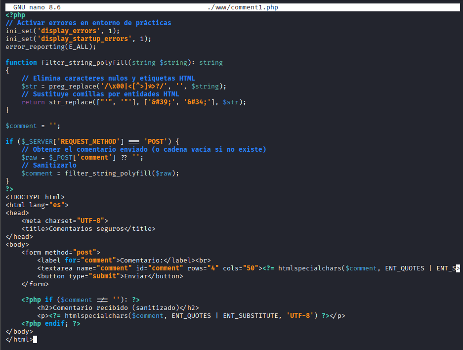

La función que hemos creado al principio del documento: filter_string_polyfill nos va a eliminar todos los caracteres peligrosos y nos cambia caracteres conflictivos.

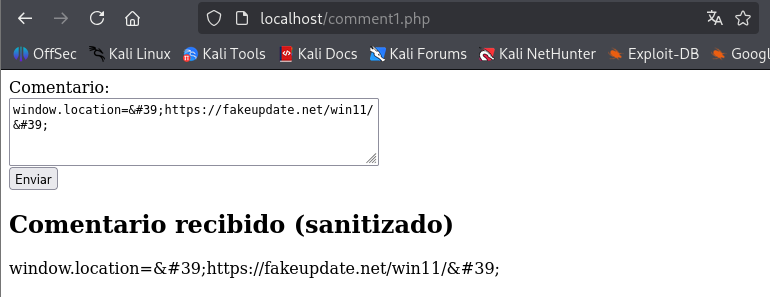

**Sanitizar la entrada con htmlspecialchars()**
---
htmlspecialchars() convierte caracteres especiales en sus equivalentes entidades HTML. Esto garantiza que incluso si el usuario ingresa una cadena que contiene etiquetas o código HTML, se mostrará como texto sin formato en lugar de que el navegador lo ejecute.
- <script> → &lt;script&gt;
- " → &quot;
- ' → &#39;

Con esta corrección, el intento de inyección de JavaScript se mostrará como texto en lugar de ejecutarse.

Creamos un archivo comment2.php con el siguiente contenido:

```php
<?php
// Mostrar errores en entorno de prácticas
ini_set('display_errors', 1);
ini_set('display_startup_errors', 1);
error_reporting(E_ALL);

$comment = '';

if ($_SERVER['REQUEST_METHOD'] === 'POST') {
    // Recogemos el comentario crudo del formulario
    $comment = $_POST['comment'] ?? '';
}
?>
<!DOCTYPE html>
<html lang="es">
<head>
    <meta charset="UTF-8">
    <title>Comentarios seguros</title>
</head>
<body>
    <h1>Comentarios (versión con htmlspecialchars)</h1>

    <form method="post">
        <label for="comment">Comentario:</label><br>
        <textarea name="comment" id="comment" rows="4" cols="50">
<?= htmlspecialchars($comment, ENT_QUOTES | ENT_SUBSTITUTE, 'UTF-8') ?>
        </textarea><br>
        <button type="submit">Enviar</button>
    </form>

    <?php if ($comment !== ''): ?>
        <h2>Comentario recibido (escapado)</h2>
        <p><?= htmlspecialchars($comment, ENT_QUOTES | ENT_SUBSTITUTE, 'UTF-8') ?></p>
    <?php endif; ?>
</body>
</html>

```

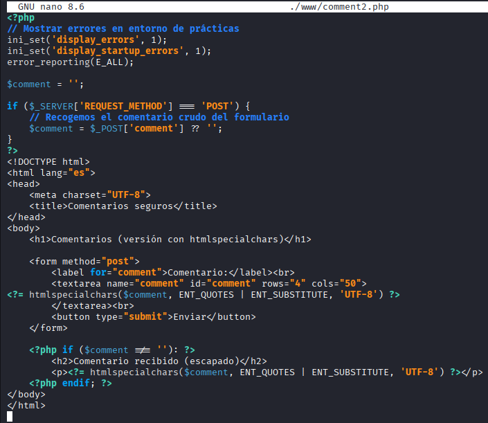

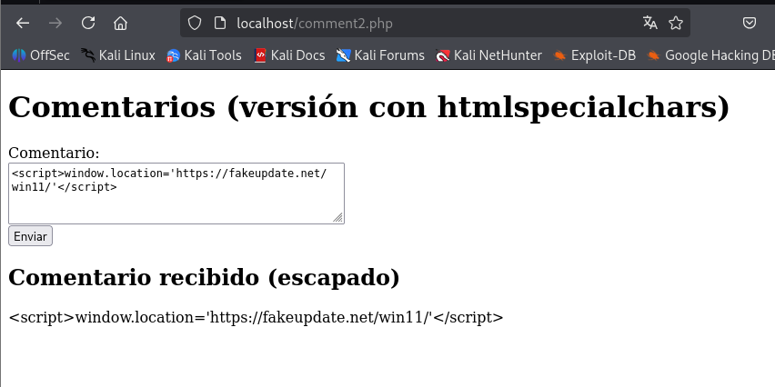

Aunque usar htmlspecialchars() es una buena medida para prevenir ataques XSS, todavía se puede mejorar la
seguridad y funcionalidad del código con los siguientes puntos:

**Validación de entrada**
---

Actualmente, el código permite que el usuario envíe cualquier contenido, incluyendo texto vacío o datos
demasiado largos. Puedes agregar validaciones para asegurarte de que el comentario sea adecuado:

Creamos un archivo comment3.php con el siguiente contenido:

```php
<?php
// Mostrar errores en entorno de prácticas
ini_set('display_errors', 1);
ini_set('display_startup_errors', 1);
error_reporting(E_ALL);

$comment = '';
$error   = '';

if ($_SERVER['REQUEST_METHOD'] === 'POST') {
    $comment = $_POST['comment'] ?? '';
    $comment = trim($comment); // opcional, para no aceptar solo espacios

    $length = mb_strlen($comment, 'UTF-8'); // mejor que strlen con tildes [web:54][web:63]

    if ($length === 0) {
        $error = 'El comentario no puede estar vacío.';
    } elseif ($length > 500) {
        $error = 'El comentario no puede tener más de 500 caracteres.';
    }
}
?>
<!DOCTYPE html>
<html lang="es">
<head>
    <meta charset="UTF-8">
    <title>Comentarios (comment3)</title>
</head>
<body>
    <h1>Comentarios (comment3, con validación)</h1>

    <?php if ($error !== ''): ?>
        <p style="color: red;">
            <?= htmlspecialchars($error, ENT_QUOTES | ENT_SUBSTITUTE, 'UTF-8') ?>
        </p>
    <?php endif; ?>

    <form method="post">
        <label for="comment">Comentario:</label><br>
        <textarea name="comment" id="comment" rows="4" cols="50">
<?= htmlspecialchars($comment, ENT_QUOTES | ENT_SUBSTITUTE, 'UTF-8') ?>
        </textarea><br>
        <button type="submit">Enviar</button>
    </form>

    <?php if ($error === '' && $comment !== ''): ?>
        <h2>Comentario recibido</h2>
        <p><?= htmlspecialchars($comment, ENT_QUOTES | ENT_SUBSTITUTE, 'UTF-8') ?></p>
    <?php endif; ?>
</body>
</html>

```

Evita comentarios vacíos o excesivamente largos (500 caracteres).

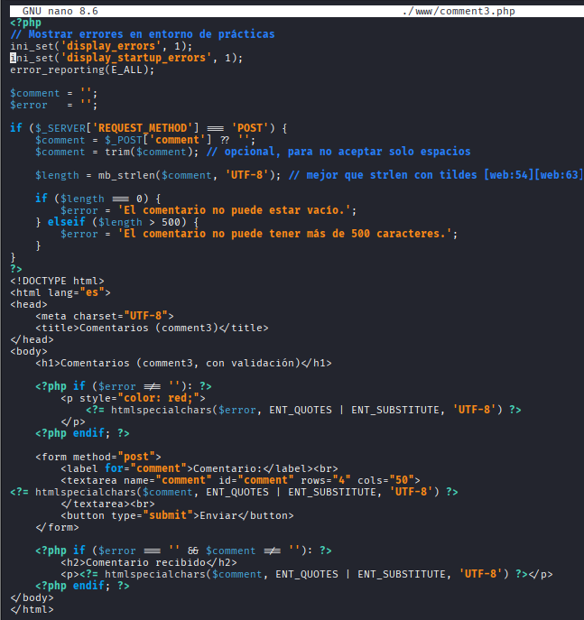

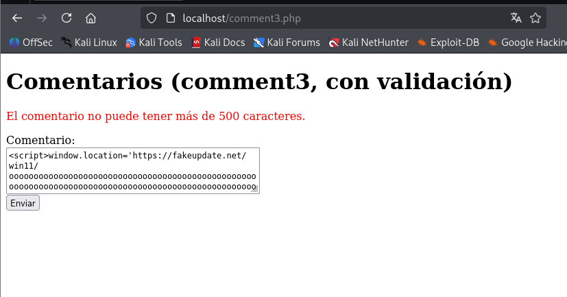

**Protección contra inyecciones HTML y JS (XSS)**
---
Si bien htmlspecialchars() mitiga la ejecución de scripts en el navegador, se puede reforzar con strip_tags() si
solo se quiere texto sin etiquetas HTML:

`$comment = strip_tags($_POST['comment']);`

Elimina etiquetas HTML completamente. Útil si no quieres permitir texto enriquecido (bold, italic, etc.).

Si en cambio si se quiere permitir algunas etiquetas (por ejemplo, \<b\> y \<i\>), se puede hacer:

`$comment = strip_tags($_POST['comment'], '<b><i>');`

**Protección contra ataques CSRF**
---
Actualmente, cualquiera podría enviar comentarios en el formulario con una solicitud falsa desde otro sitio web.

Para prevenir esto, se puede generar un token CSRF y verificarlo antes de procesar el comentario.

En la [proxima actividad sobre ataques CSRF](https://github.com/jmmedinac03vjp/PPS-Unidad3Actividad6-CSRF) lo veremos más detenidamente.

_Generar y almacenar el token en la sesión_
```PHP
session_start();
if (!isset($_SESSION['csrf_token'])) {
$_SESSION['csrf_token'] = bin2hex(random_bytes(32));
}
```

_Agregar el token al formulario_
`<input type="hidden" name="csrf_token" value="<?php echo $_SESSION['csrf_token']; ?>">`

_Verificar el token antes de procesar el comentario_
```PHP
if (!isset($_POST['csrf_token']) || $_POST['csrf_token'] !== $_SESSION['csrf_token'])
{
die("Error: Token CSRF inválido.");
}
```
Estas modificaciones previenen ataques de falsificación de solicitudes (CSRF).

---
# Código Seguro


Creamos el archivo comment4.php con todas las mitigaciones.

```PHP
<?php
// Mostrar errores en entorno de prácticas
ini_set('display_errors', 1);
ini_set('display_startup_errors', 1);
error_reporting(E_ALL);

// Función de filtrado original (la mantengo tal cual la tenías)
function filter_string_polyfill(string $string): string
{
    // Elimina caracteres nulos y etiquetas HTML
    $str = preg_replace('/\x00|<[^>]*>?/', '', $string);
    // Sustituye comillas por entidades HTML
    return str_replace(["'", '"'], ['&#39;', '&#34;'], $str);
}

session_start();

// Generar token CSRF si no existe
if (!isset($_SESSION['csrf_token'])) {
    $_SESSION['csrf_token'] = bin2hex(random_bytes(32));
}

$comment = '';
$error   = '';
$success = '';

if ($_SERVER["REQUEST_METHOD"] === "POST") {
    // Verificar el token CSRF
    if (!isset($_POST['csrf_token']) || $_POST['csrf_token'] !== $_SESSION['csrf_token']) {
        $error = "Error: Token CSRF inválido.";
    } else {
        // Obtener y sanitizar el comentario
        $comment = $_POST['comment'] ?? '';
        $comment = filter_string_polyfill($comment);
        $comment = htmlspecialchars($comment, ENT_QUOTES | ENT_SUBSTITUTE, 'UTF-8');

        // Validación de longitud y evitar comentarios vacíos
        $length = mb_strlen($comment, 'UTF-8');

        if ($length === 0) {
            $error = "El comentario no puede estar vacío.";
        } elseif ($length > 500) {
            $error = "El comentario no puede tener más de 500 caracteres.";
        } else {
            $success = "Comentario publicado:";
        }
    }
}
?>
<!DOCTYPE html>
<html lang="es">
<head>
    <meta charset="UTF-8">
    <title>Comentarios seguros (comment4)</title>
</head>
<body>
    <h1>Comentarios (comment4, con CSRF y filtro)</h1>

    <?php if ($error !== ''): ?>
        <p style="color: red;">
            <?= htmlspecialchars($error, ENT_QUOTES | ENT_SUBSTITUTE, 'UTF-8') ?>
        </p>
    <?php endif; ?>

    <?php if ($success !== '' && $comment !== ''): ?>
        <p style="color: green;">
            <?= htmlspecialchars($success, ENT_QUOTES | ENT_SUBSTITUTE, 'UTF-8') ?>
        </p>
    <?php endif; ?>

    <form method="post">
        <label for="comment">Comentario:</label><br>
        <textarea name="comment" id="comment" rows="4" cols="50">
<?= $comment ?>
        </textarea><br>

        <!-- Campo oculto con el token CSRF -->
        <input type="hidden" name="csrf_token" value="<?= htmlspecialchars($_SESSION['csrf_token'], ENT_QUOTES | ENT_SUBSTITUTE, 'UTF-8') ?>">

        <button type="submit">Enviar</button>
    </form>

    <?php if ($success !== '' && $comment !== ''): ?>
        <h2>Comentario recibido</h2>
        <p><?= $comment ?></p>
    <?php endif; ?>
</body>
</html>
```
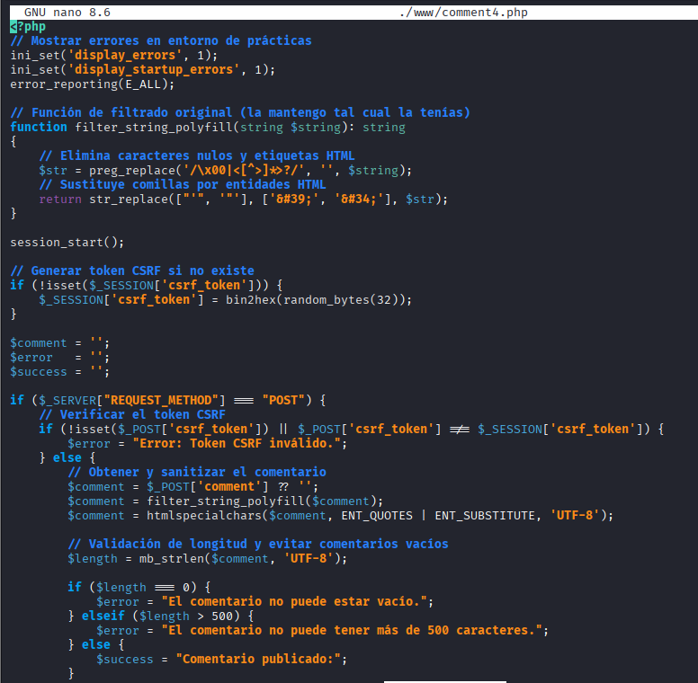

**Ahora podremos defendernos de todos los tipos de ataque CrossSiteScripting-XSS**

- **XSS básico (reflejado)**

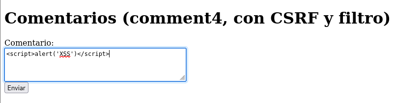

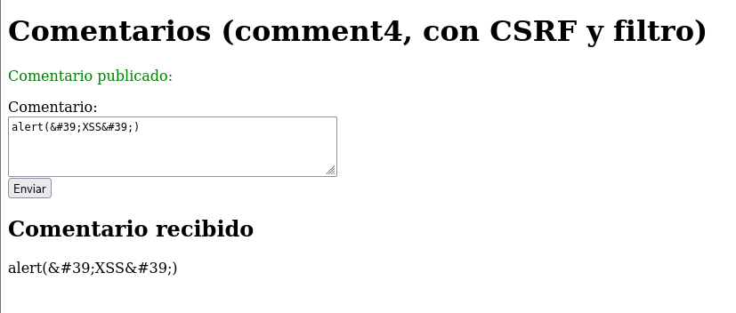

- **Con atributo HTML**

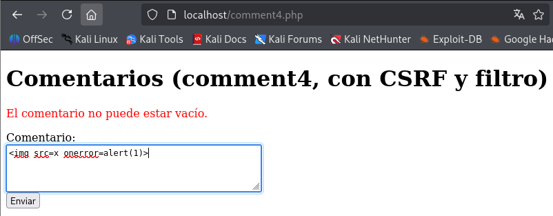

- **Inyección en atributos**

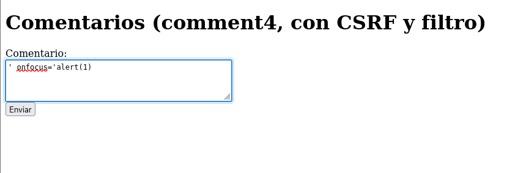

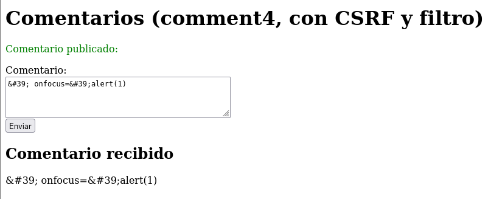

- **Payloads codificados (URL encoding)**

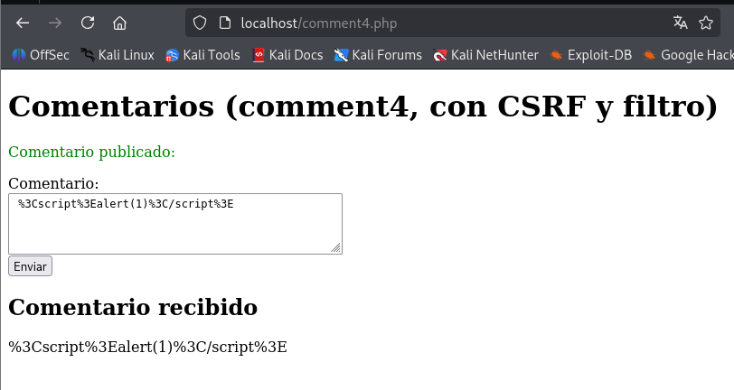

-  **Payloads codificados (HTML entities)**

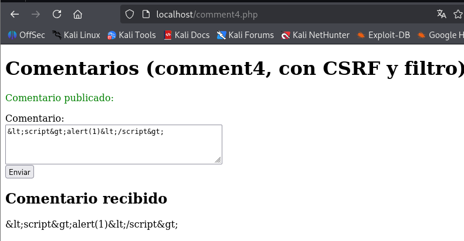

- **Capturar cookies del usuario**

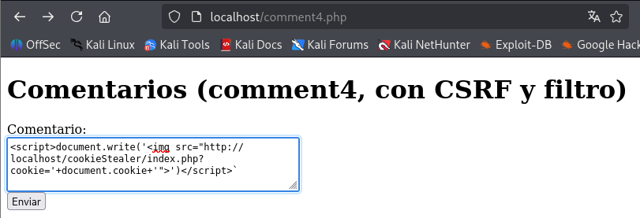

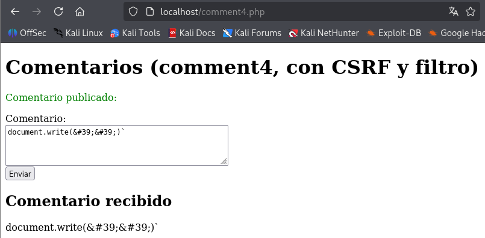


**Todos estos cambios en el código han sido gracias a estas medidas de seguridad implementadas**

1. Eliminación de etiquetas HTML y caracteres nulos:

La función filter_string_polyfill() usa preg_replace('/\x00|<[^>]*>?/', '', $string); para eliminar caracteres nulos (\x00) y cualquier etiqueta HTML (<[^>]*>?). Esto reduce la posibilidad de inyección de scripts.

2. Escapado de comillas:

En filter_string_polyfill(), las comillas simples (') y dobles (") se reemplazan por sus equivalentes en entidades HTML (&#39; y &#34;). Esto evita el cierre prematuro de atributos en HTML.

3. Uso de htmlspecialchars:

Después de aplicar filter_string_polyfill(), se vuelve a ejecutar htmlspecialchars($comment, ENT_QUOTES, 'UTF-8');, lo que convierte caracteres especiales en entidades HTML.

	- ENT_QUOTES protege contra XSS al convertir tanto comillas simples como dobles en sus versiones seguras (&#39; y &#34;).

	- UTF-8 previene ataques basados en codificaciones incorrectas.  

4. Validación de longitud y contenido:

Se valida que el comentario no esté vacío y que no supere los 500 caracteres. Aunque esto no previene directamente XSS, ayuda a limitar intentos de ataques masivos.

